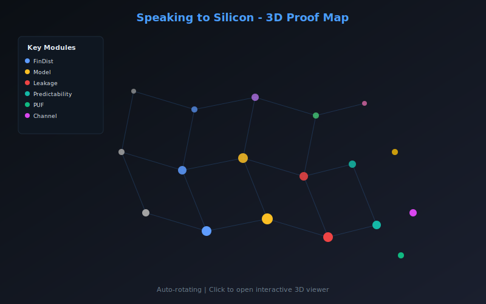

<sub><strong>Our tech stack is ontological:</strong><br>
<strong>Hardware — Physics</strong><br>
<strong>Software — Mathematics</strong><br><br>
<strong>Our engineering workflow is simple:</strong> discover, build, grow, learn & teach</sub>

---

<sub>
<strong>Notice of Proprietary Information</strong><br>
This document outlines foundational concepts and methodologies developed during internal research and development at Apoth3osis. To protect our intellectual property and adhere to client confidentiality agreements, the code, architectural details, and performance metrics presented herein may be simplified, redacted, or presented for illustrative purposes only. This paper is intended to share our conceptual approach and does not represent the full complexity, scope, or performance of our production-level systems. The complete implementation and its derivatives remain proprietary.
</sub>

---

# Speaking to Silicon

[](https://lean-lang.org)
[](https://github.com/leanprover-community/mathlib4)
[](LICENSE)
[](RESEARCHER_BUNDLE/HeytingLean/Silicon.lean)

## Credo

> *"The fundamental problem of communication is that of reproducing at one point either exactly or approximately a message selected at another point."*
> — **Claude Shannon**, *A Mathematical Theory of Communication* (1948)

When silicon computes, it speaks. Every transistor switching, every cache miss, every branch misprediction leaks information through timing, power, and electromagnetic emanations. This formalization provides the mathematical foundation for understanding, quantifying, and ultimately controlling what silicon says.

### Acknowledgment

We humbly thank the collective intelligence of humanity for providing the technology and culture we cherish. We do our best to properly reference the authors of the works utilized herein, though we may occasionally fall short. Our formalization acts as a reciprocal validation—confirming the structural integrity of their original insights while securing the foundation upon which we build. In truth, all creative work is derivative; we stand on the shoulders of those who came before, and our contributions are simply the next link in an unbroken chain of human ingenuity.

---

**Machine-checked formalization of silicon information leakage using finite probability theory.**

<table>
<tr>
<td align="center" width="50%">
<strong>2D Proof Map</strong><br/>
<em>Click to explore: pan, zoom, search declarations</em><br/>
<a href="https://abraxas1010.github.io/speaking-to-silicon/RESEARCHER_BUNDLE/artifacts/visuals/silicon_2d.html">
  
</a><br/>
<a href="https://abraxas1010.github.io/speaking-to-silicon/RESEARCHER_BUNDLE/artifacts/visuals/silicon_2d.html">▶ Open Interactive 2D Map</a>
</td>
<td align="center" width="50%">
<strong>3D Proof Map</strong><br/>
<em>Click to explore: rotate, zoom, click nodes</em><br/>
<a href="https://abraxas1010.github.io/speaking-to-silicon/RESEARCHER_BUNDLE/artifacts/visuals/silicon_3d.html">
  
</a><br/>
<a href="https://abraxas1010.github.io/speaking-to-silicon/RESEARCHER_BUNDLE/artifacts/visuals/silicon_3d.html">▶ Open Interactive 3D Map</a>
</td>
</tr>
</table>

## Why This Matters

Side-channel attacks exploit unintended information leakage from computing devices. This formalization provides:

1. **Rigorous Definitions**: Leakage as mutual information I(S; O) between secret state and observable output
2. **Provable Bounds**: Independence implies zero leakage (with machine-checked proof)
3. **Predictability Witnesses**: If a predictor beats the baseline, the system is provably not independent
4. **Cost Models**: Energy savings from early-abort strategies with formal bounds

## Key Results

### Core Theorems

| Theorem | Statement | Module |
|---------|-----------|--------|
| `leakage_eq_zero_of_independent` | Independence ⇒ Leakage = 0 | Silicon/Leakage |
| `not_independent_of_accuracy_gt_baseline` | Predictor beats baseline ⇒ ¬Independent | Silicon/Predictability |
| `energySavings_theoreticalMax` | Energy savings ≤ 1 - k/n | Silicon/Cost |
| `exists_singleton_response_prob_ne` | PUF distinguishability witness | Silicon/PUF |

### Module Architecture

```
Silicon/
├── Model.lean         # Run := FinDist (S × O)
├── Leakage.lean       # I(S; O), Independence, leakage theorems
├── Signature.lean     # Device distinguishability
├── EarlyAbort.lean    # Prefix prediction, accuracy bounds
├── Empirical.lean     # Data → FinDist bridge
├── Predictability.lean # Accuracy bounds, non-independence witnesses
├── Cost.lean          # Energy savings model
├── Channel.lean       # Stochastic channel scaffold
├── PUF.lean           # Physical unclonable functions
└── Examples.lean      # Concrete finite examples
```

### Information Theory Foundation

```
Probability/InfoTheory/
├── Core.lean          # safeLog, klTerm, entropyTerm
├── FinDist.lean       # Finite distributions, marginals, products
├── Entropy.lean       # Shannon entropy H(X)
├── KL.lean            # KL divergence D(P||Q)
├── MutualInfo.lean    # Mutual information I(X; Y)
└── Conditional.lean   # Conditional distributions
```

## Quick Start

```bash
cd RESEARCHER_BUNDLE

# First time: fetch dependencies (downloads ~500MB)
lake update

# Build (first build compiles Mathlib, takes 30-60 min)
# Subsequent builds are fast (seconds)
lake build --wfail

# Verify no sorry/admit
grep -r "sorry\|admit" HeytingLean/ && echo "FAIL" || echo "PASS"
```

**Tip**: For faster first build, use Mathlib cache if available:
```bash
lake exe cache get  # Downloads pre-built Mathlib oleans
lake build --wfail
```

## Mathematical Framework

### Runs and Leakage

A **run** is a joint distribution P(S × O) over internal state S and observable output O:

```lean
abbrev Run (S O : Type) [Fintype S] [Fintype O] := FinDist (S × O)
```

**Leakage** is the mutual information between state and observable:

```lean
abbrev Leakage (P : Run S O) : ℝ := mutualInfo P
```

### Independence and Zero Leakage

A run is **independent** if it equals the product of its marginals:

```lean
def Independent (P : Run S O) : Prop := P = prodMarginals P

theorem leakage_eq_zero_of_independent (P : Run S O) (h : Independent P) :
    Leakage P = 0
```

### Predictability Witnesses

If any predictor achieves accuracy greater than the baseline (best constant predictor), the system is provably not independent:

```lean
theorem not_independent_of_accuracy_gt_baseline
    (P : FinDist (X × Y)) (g : X → Y)
    (hgt : maxMass (marginalRight P) < accuracy P g) :
    ¬Independent P
```

## References

- Shannon, C.E. (1948). *A Mathematical Theory of Communication*. Bell System Technical Journal.
- Kocher, P.C. (1996). *Timing Attacks on Implementations of Diffie-Hellman, RSA, DSS, and Other Systems*. CRYPTO.
- Cover, T.M. & Thomas, J.A. (2006). *Elements of Information Theory*. Wiley.

## License

This project is provided under the Apoth3osis License Stack v1.
See `LICENSE.md` and the files under `licenses/`.
